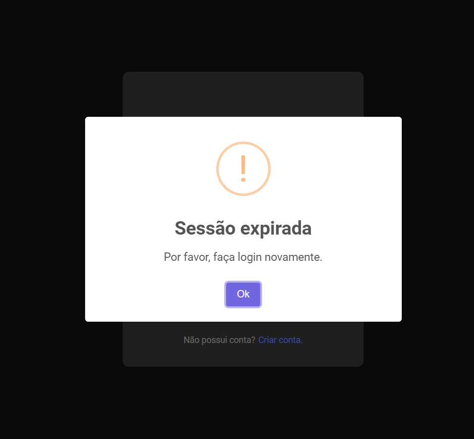
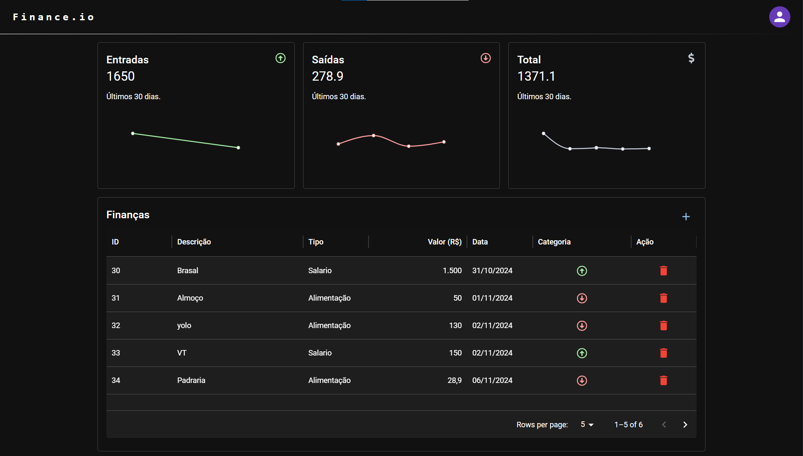
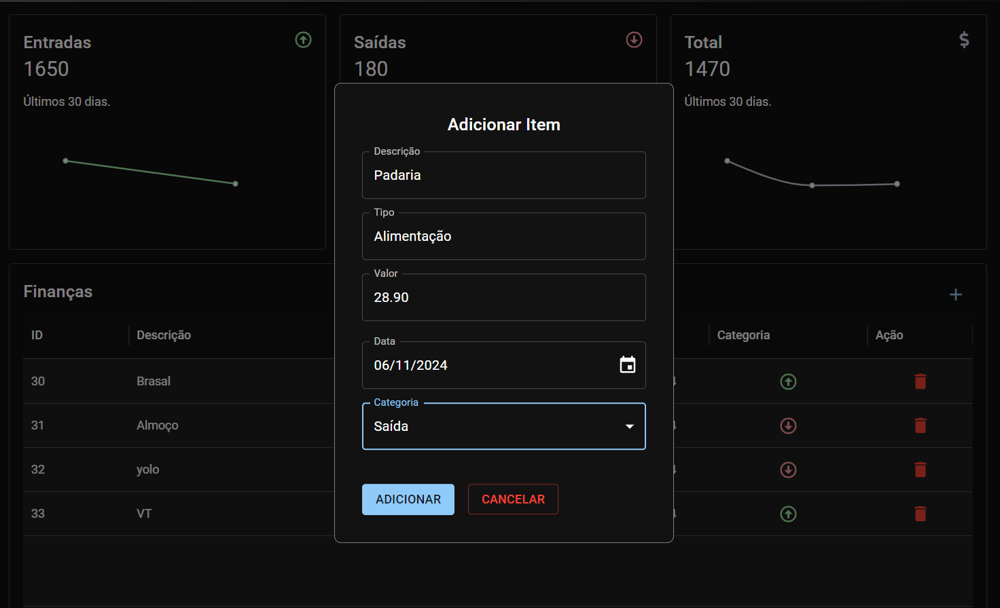
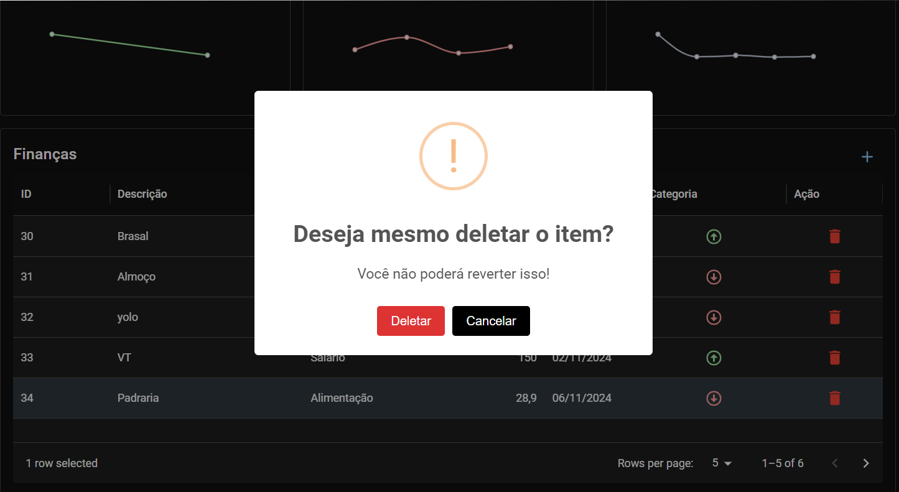

# Sistema de Autenticação e Controle Financeiro

Sistema completo de autenticação de login e cadastro de usuários, que oferece
a capacidade de controlar suas finanças pessoais.
O sistema permite visualizar entradas, saídas e o total de transações,
com gráficos dinâmicos para melhor visualização.
Além disso, os usuários podem adicionar e deletar
valores de uma tabela de finanças.

## Funcionalidades

- **Autenticação de Usuários**:

  - Cadastro de novos usuários.
  - Login com verificação de credenciais.
  - O sistema utiliza **tokens JWT** para autenticação.
  - O token de autenticação tem uma duração de 1 hora. Após esse tempo, o usuário precisa se autenticar novamente.
  - A cada acesso à página protegida, o token do usuário é validado.

- **Controle Financeiro**:

  - Visualização das **entradas** e **saídas** de forma separada.
  - **Total** atualizado automaticamente com base nas transações.
  - **Gráficos dinâmicos** para uma melhor visualização das entradas e saídas.

- **Tabela de Finanças**:
  - Tabela que exibe todas as transações financeiras.
  - Funcionalidade de **adicionar** e **deletar** transações.
  - Cada transação pode ser categorizada como "entrada" ou "saída", e o total é automaticamente atualizado.

## Imagens da Aplicação

|  |  |
| ----------------------------------- | --------------------------------------- |
| Tela de Login                       | Sessão Expirada                        |

|  |
| -------------------------------------------------------------------------- |
|           Página de Finanças         |

|  |  |
| ----------------------------------- | --------------------------------------- |
| Adicionar Item                       | Deletar Item                       |


## Como Usar

1. Cadastro de Usuário: Ao acessar o sistema, o usuário pode criar uma conta fornecendo as informações necessárias.
2. Login: Após o cadastro, o usuário pode realizar login com seu email e senha. O sistema retorna um token JWT.
3. Controle de Finanças: Com o token, o usuário pode visualizar e gerenciar suas finanças, com a opção de adicionar ou deletar entradas e saídas.
4. Gráficos: A visualização de entradas e saídas é atualizada automaticamente, e os gráficos fornecem uma visão clara do fluxo financeiro.

## Fluxo de Autenticação

- Quando o usuário realiza login, um token JWT é gerado e armazenado no localStorage do navegador.
- O token é enviado em cada requisição subsequente para validação.
- O token tem uma duração de 1 hora. Após esse tempo, o token expira e o usuário precisa fazer login novamente.
- O sistema valida o token em todas as requisições protegidas e garante que o usuário tenha permissão para acessar as informações.

## Tecnologias Usadas

- **Frontend**:

  - React
  - Javascript
  - Material UI
  - Axios para chamadas API

- **Backend**:
  - Node.js
  - Typescript
  - Express
  - JWT (JSON Web Token) para autenticação
  - Bcrypt para comparação de hashs
  - Prisma para comunicação e manipulação de banco de dados

## Instalação

### Pré-requisitos

- Node.js (v18 ou superior)
- NPM ou Yarn

### Passos para executar o projeto

1. **Clone o repositório:**

```bash
git clone https://github.com/username/repository-name.git
```

2. **Instale as dependências do Backend:**

```bash
cd backend
npm install
```

3. **Instale as dependências do Frontend:**

```bash
cd frontend
npm install
```

4. **Rodando o Backend e Frontend:**

- Inicie o backend:

```bash
cd Backend
npm run dev
```

- Inicie o frontend:

```bash
cd frontend
npm start
```
